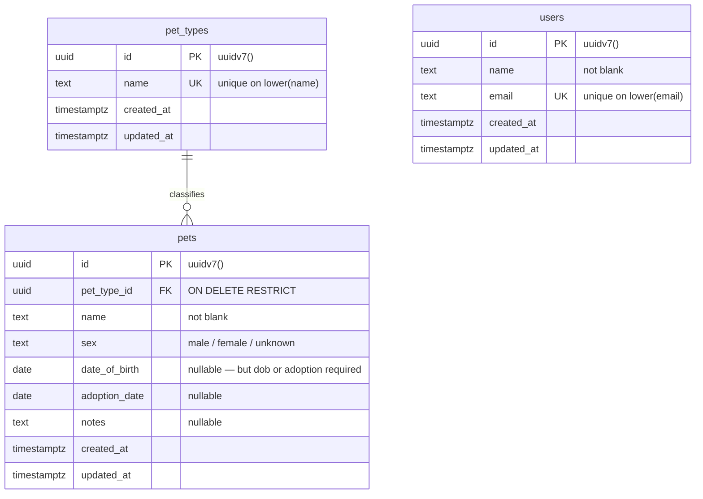
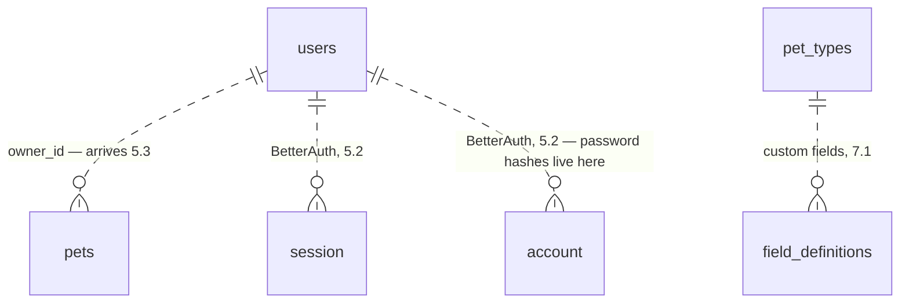

# Core domain model

- **Born:** topic 3.2 — hand-modeled in plain SQL before any tool touches it.
- **Files:** [`schema.sql`](./schema.sql) is the runnable, annotated DDL — the line-by-line why lives there. This file is the map: the diagram, the decisions, and what's deliberately missing.
- **Fate:** 3.3 picks the data-access layer; 3.4 regenerates this model through that tool as the baseline migration. If this file and an applied migration ever disagree, the migration is the truth and this file gets updated.

## The shape today

`users` has no edges yet. That is deliberate — see [What's deliberately missing](#whats-deliberately-missing).

## Decisions

### Primary keys: `uuid` defaulting to `uuidv7()`

Every table: `id uuid PRIMARY KEY DEFAULT uuidv7()`, generated by the database — native in Postgres 18, no extension.

- Over **UUIDv4** (`gen_random_uuid()`): v7 is time-ordered, so new keys land near each other in the B-tree instead of splattering randomly across it — v4's classic index-bloat cost, gone for free.
- Over **`bigint GENERATED ALWAYS AS IDENTITY`**: smaller and marginally faster to join, but sequential ids are enumerable (`/pets/1`, `/pets/2`, …) and awkward the moment an id must be minted anywhere but this one database.
- The tradeoff accepted: a v7 id embeds a millisecond timestamp, so an id reveals roughly when its row was created. Harmless for this domain; the auth layer can choose differently for its own tables in Phase 5.

### Naming conventions

| Rule                                              | Example                                        |
| ------------------------------------------------- | ---------------------------------------------- |
| Tables plural, snake_case                         | `pet_types`                                    |
| Primary key always `id`                           | `pets.id`                                      |
| Foreign keys `<singular>_id`                      | `pets.pet_type_id`                             |
| Instants are `timestamptz`, calendar facts `date` | `created_at` vs `date_of_birth`                |
| CHECK constraints named `<table>_<what>_ck`       | `pets_dob_or_adoption_ck`                      |
| Unique indexes `_ux`, plain indexes `_idx`        | `users_email_lower_ux`, `pets_pet_type_id_idx` |

Named constraints aren't cosmetic: the name is the string in every violation error, and the handle a future migration grabs to alter or drop the rule.

### The database owns integrity; Zod owns syntax

The DDL enforces what must never be false regardless of which code path writes: presence (`NOT NULL` plus not-blank CHECKs — absence and blankness are different failure modes), relationships (FKs), uniqueness (`lower()` unique indexes), domain membership (`sex`), and the one real business rule — a pet has a date of birth or an adoption date, inclusive or, never neither. Format and shape rules (email syntax, name lengths, "dates can't be in the future") belong to the Zod boundary from 4.1 onward. The future-dates CHECK is deliberately absent: `CURRENT_DATE` isn't immutable, so a row that was legal at insert could fail a later dump/restore.

## What's deliberately missing

- **`pets.owner_id`** (`uuid NOT NULL REFERENCES users ON DELETE CASCADE`, plus its index) waits for 5.3 so Phase 4 can build and test CRUD before login exists. CASCADE there against RESTRICT on `pet_type_id` is the deliberate contrast: deleting an account takes its pets with it; deleting a catalog row can never take pets down.
- **BetterAuth's tables** (`session`, `account`, `verification`, plus `emailVerified`/`image` on the user model) arrive via its own generated migration in 5.2. `users` here is the minimal compatible core: BetterAuth can map its user model onto a table named `users` (`modelName`) and can leave id generation to the database (`advanced.database.generateId: false`), so these uuid keys stay viable. The exact reconciliation is 5.2's call.
- **No password column, ever.** BetterAuth keeps credential hashes in its `account` table; a `users.password_hash` modeled now would be a trap.
- **Custom fields** (`field_definitions` rows per pet type, a `custom_values` JSONB column on pets, and its GIN index) are the Phase 7 signature feature — 7.1 designs them with the care they deserve.

## Access patterns the indexes anticipate

| Query the app will run                             | Served by                 |
| -------------------------------------------------- | ------------------------- |
| Log in / find account by email                     | `users_email_lower_ux`    |
| List a user's pets — the hot path                  | `pets_owner_id_idx` (5.3) |
| Pets of a type; `ON DELETE RESTRICT` pointer check | `pets_pet_type_id_idx`    |
| Pet detail by id                                   | `pets_pkey`               |

Postgres indexes the _referenced_ side of every FK automatically (it's a primary key) but never the referencing column — hence the explicit index on `pets.pet_type_id`, and one more on `pets.owner_id` the day it exists.
